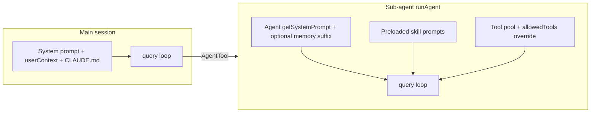

# 自建 Agent：从 Claude Code 源码可继承的配置与架构启示

**Building your own agent: configuration layers and patterns inferred from this codebase.**

> 本文基于仓库内 `src/` 镜像做**机制归纳**；若你实现独立产品，请自行评审许可与合规，勿将本文视为对上游产品的复刻指南。

---

## 1. 概念对齐：你问的 SOUL / SKILL 在源码里对应什么？（Mapping “SOUL” and SKILL）

### 1.1 「SOUL」在 Claude Code 中的真实含义

源码里 **SOUL** 并非通用 Agent 字段，而是 **Buddy（伴侣）功能** 的持久化结构：`CompanionSoul` 只包含 **`name`** 与 **`personality`**，由模型在首次「孵化」时生成并写入配置；与「子代理 / AgentTool」是不同子系统。

```110:114:src/buddy/types.ts
// Model-generated soul — stored in config after first hatch
export type CompanionSoul = {
  name: string
  personality: string
}
```

**对你自建 Agent 的启示（English takeaway）：** 把「SOUL」泛化为 **长期人设存储（persistent persona store）**：与其它上下文（system prompt、每轮 reminder、skills、memory 文件）分离，便于 UI 展示与增量更新。

### 1.2 「Agent 人格 / 行为内核」在源码中的落点

与「可调度的工作者 Agent」直接相关的不是 `CompanionSoul`，而是 **`AgentDefinition`** 上的这些维度（后文分节展开）：

| 层次 | 源码锚点 | 作用 |
|------|----------|------|
| 系统指令主体 | `getSystemPrompt` / Markdown 正文 | 角色、边界、输出格式 |
| 何时启用 | `whenToUse`（来自 frontmatter `description`） | 供父模型或路由选择子代理 |
| 每轮强化 | `criticalSystemReminder_EXPERIMENTAL` | 每个 user turn 再注入的短提醒（`ToolUseContext`，见 `attachments.ts`） |
| 长期记忆 | `memory: user \| project \| local` + `loadAgentMemoryPrompt` | 将磁盘记忆摘要拼进 system prompt |
| 预载工作流 | `skills: string[]` | 子代理启动时并发加载 SKILL 内容进初始消息（`runAgent.ts`） |

---

## 2. Agent 可配置项：从类型与加载器反推清单（Agent configuration inventory）

### 2.1 统一类型 `BaseAgentDefinition`（节选）

```105:132:src/tools/AgentTool/loadAgentsDir.ts
export type BaseAgentDefinition = {
  agentType: string
  whenToUse: string
  tools?: string[]
  disallowedTools?: string[]
  skills?: string[] // Skill names to preload (parsed from comma-separated frontmatter)
  mcpServers?: AgentMcpServerSpec[] // MCP servers specific to this agent
  hooks?: HooksSettings // Session-scoped hooks registered when agent starts
  color?: AgentColorName
  model?: string
  effort?: EffortValue
  permissionMode?: PermissionMode
  maxTurns?: number // Maximum number of agentic turns before stopping
  filename?: string // Original filename without .md extension (for user/project/managed agents)
  baseDir?: string
  criticalSystemReminder_EXPERIMENTAL?: string // Short message re-injected at every user turn
  requiredMcpServers?: string[] // MCP server name patterns that must be configured for agent to be available
  background?: boolean // Always run as background task when spawned
  initialPrompt?: string // Prepended to the first user turn (slash commands work)
  memory?: AgentMemoryScope // Persistent memory scope
  isolation?: 'worktree' | 'remote' // Run in an isolated git worktree, or remotely in CCR (ant-only)
  pendingSnapshotUpdate?: { snapshotTimestamp: string }
  omitClaudeMd?: boolean
}
```

**自建方案建议（English）：** 最小可用 Agent 配置 = **`agentType` + `whenToUse` + system prompt + 工具白/黑名单**；生产级再叠 **`permissionMode`、`maxTurns`、MCP、hooks、memory、skills 预载**。

### 2.2 Markdown Agent 文件（`.claude/agents/*.md`）

`parseAgentFromMarkdown` 解析的 **frontmatter** 字段包括：

- **必选**：`name` → `agentType`，`description` → `whenToUse`  
- **可选**：`color`、`model`、`background`、`memory`、`isolation`、`effort`、`permissionMode`、`maxTurns`、`tools`、`disallowedTools`、`skills`（与 slash command 相同解析逻辑）、`initialPrompt`、`mcpServers`、`hooks`  
- **正文**：整段 Markdown **trim 后作为 system prompt**；若启用 `memory`，运行时追加 `loadAgentMemoryPrompt`  

启用 `memory` 时，若开启 auto memory，会自动把 **Write / Edit / Read** 工具并入列表，以便代理读写记忆目录（`parseAgentFromMarkdown` 内与 `parseAgentFromJson` 相同策略）。

### 2.3 JSON Agent（设置 / Flag / SDK）

`AgentJsonSchema` 校验字段与 Markdown 对齐核心集合：`description`、`tools`、`disallowedTools`、`prompt`、`model`、`effort`、`permissionMode`、`mcpServers`、`hooks`、`maxTurns`、`skills`、`initialPrompt`、`memory`、`background`、`isolation`（见 `loadAgentsDir.ts` 中 schema）。

SDK 侧 `AgentDefinitionSchema`（`entrypoints/sdk/coreSchemas.ts`）对 **`criticalSystemReminder_EXPERIMENTAL`、`skills`、`initialPrompt`、`memory`** 等有文档化的 `.describe()`，适合作为你对外 API 的参考形状。

### 2.4 代理优先级与合并（多来源覆盖）

`getActiveAgentsFromList` 按 **built-in → plugin → userSettings → projectSettings → flagSettings → policySettings** 分组后写入 `Map`，**后序来源同名覆盖前序**——即**项目/策略可覆盖用户默认**。自建多租户时可用同一模式做「默认 Agent Registry + 租户 overlay」。

---

## 3. Skill 可配置项：从 `parseSkillFrontmatterFields` 反推（Skill configuration）

Skill 从 **`SKILL.md`（或插件/打包路径）** 加载，`parseSkillFrontmatterFields` 统一解析的关键字段包括：

| Frontmatter 键 | 作用 |
|----------------|------|
| `description` / 正文摘要 | 展示与模型选 Skill 的语义 |
| `name` | 显示名 |
| `allowed-tools` | 本 Skill 建议允许的工具子集（与全局权限模型配合） |
| `argument-hint` / `arguments` | 用户/模型传参提示 |
| `when_to_use` | 使用场景说明 |
| `version` | 版本 |
| `model` / `inherit` | Skill 级模型覆盖 |
| `effort` | 推理强度 |
| `disable-model-invocation` | 是否禁止模型自动唤起 |
| `user-invocable` | 用户是否可通过 `/` 直接调用 |
| `hooks` | 会话钩子 |
| `context: fork` | 执行上下文 |
| `agent` | 绑定到特定 agent 类名 |
| `shell` | Shell 相关技能配置 |

Skill 的发现路径逻辑（用户 `~/.claude/skills`、托管目录、沿目录向上 `skills`、裸模式 `--add-dir` 等）在 `getSkillDirCommands`（`loadSkillsDir.ts`）——启示是：**技能与代码库解耦、按目录层级 shadowing、用 policy 关掉自动发现**。

**子代理预载 Skill**：`runAgent` 对 `agentDefinition.skills` 逐项 `resolveSkillName`，要求 **`type === 'prompt'`**，再 `getPromptForCommand` 并发加载，把内容注入初始回合（避免仅靠模型「记住」要遵守的长流程）。

---

## 4. 架构启示：主循环、子代理、工具与权限（Architecture patterns）



1. **单一 `query()` 核心**：主会话与子代理共用 `query.ts`，差异在 **messages 前缀、tool 集合、`canUseTool`**。自建时可保持「一层 orchestrator + N 个 worker 配置」而非 N 套推理代码。  
2. **工具白名单 + `disallowedTools`**：能力边界 primarily structural，不靠 prompt 自制力。  
3. **`allowedTools` 替换父级规则**（`runAgent` 注释）：子代理显式列表时 **不继承父批准**，防止权限泄漏——多 Agent 系统应默认此语义。  
4. **MCP 按 Agent 附带**：`mcpServers` 可内联或按名称引用，配合 `requiredMcpServers` 做可用性过滤（`hasRequiredMcpServers`）。  
5. **Hooks 会话作用域**：Agent 定义上的 `hooks` 在代理启动时注册，适合审计、格式化、组织策略。  
6. **Memory 三层路径**（`AgentMemoryScope`）：user / project / local，对应共享程度与是否进版本控制——可映射到你方「用户级偏好 vs 仓库级事实 vs 本地缓存」。

---

## 5. 落地「自己的 Agent 平台」时的推荐配置模式（A practical layering scheme）

下列分层与 Claude Code 的「类型与加载顺序」一致，便于迁移思路而非照搬实现：

| 层级 | 建议你配置的内容 | 类比源码 |
|------|------------------|----------|
| **Identity / Soul** | 显示名、人设 paragraph、可选持久 personality 字段 | `CompanionSoul` *或* Agent prompt 首段 |
| **Mission** | `whenToUse`、任务边界、禁止事项 | `description` / `whenToUse` |
| **Cognitive** | `model`、`effort`、`maxTurns` | `AgentDefinition` |
| **Capabilities** | tools、MCP、`disallowedTools` | 同上 + `findToolByName` 生态 |
| **Playbooks** | Skills 列表 + `SKILL.md` 本体 | `skills[]` + `getSkillDirCommands` |
| **Persistence** | memory 目录与快照策略 | `agentMemory.ts` / `memdir` |
| **Safety** | `permissionMode`、审批钩子 | `canUseTool` + `hooks` |
| **Runtime** | `background`、`isolation`、初始用户句 | `initialPrompt`、worktree |
| **Attention** | 每轮短 reminder（慎用长度） | `criticalSystemReminder_EXPERIMENTAL` |

**English summary:** Treat agent config as **composable layers**—persona, routing description, model/thinking, tool/MCP surfaces, preloaded playbooks (skills), durable memory, and permission/hook policy—all wired into **one shared agentic loop** rather than one-off prompts.

---

## 6. 关键源码索引（Key files）

| 文件 | 内容 |
|------|------|
| `src/tools/AgentTool/loadAgentsDir.ts` | Agent Markdown/JSON 解析、`BaseAgentDefinition` |
| `src/tools/AgentTool/runAgent.ts` | 子代理 `query()`、Skill 预载 |
| `src/tools/AgentTool/agentMemory.ts` | Memory 路径与 scope |
| `src/skills/loadSkillsDir.ts` | Skill 发现、`parseSkillFrontmatterFields` |
| `src/skills/bundledSkills.ts` | 内置 Skill 注册形态 |
| `src/entrypoints/sdk/coreSchemas.ts` | 对外 `AgentDefinitionSchema` |
| `src/buddy/types.ts` | `CompanionSoul`（UI 伴侣，非 Agent 核心路径） |

---

## 7. 文档说明

- **图表**：§4 使用 Mermaid，可在支持 Mermaid 的查看器中渲染。  
- **与上一篇架构文关系**：`docs/claude-code-architecture-analysis.md` 描述 **query 主链路与工程调用**；本文聚焦 **Agent / Skill / 人设与记忆的配置语义**。

---

**English one-liner:** In this codebase, “SKILL” is a first-class, file-backed playbook with rich frontmatter; “soul-like” persona for workers lives in **system prompts, optional per-turn reminders, and agent memory**, while **Buddy’s `CompanionSoul`** is a separate, persisted name/personality pair—reuse the layering, not the feature names, when designing your own agent platform.
