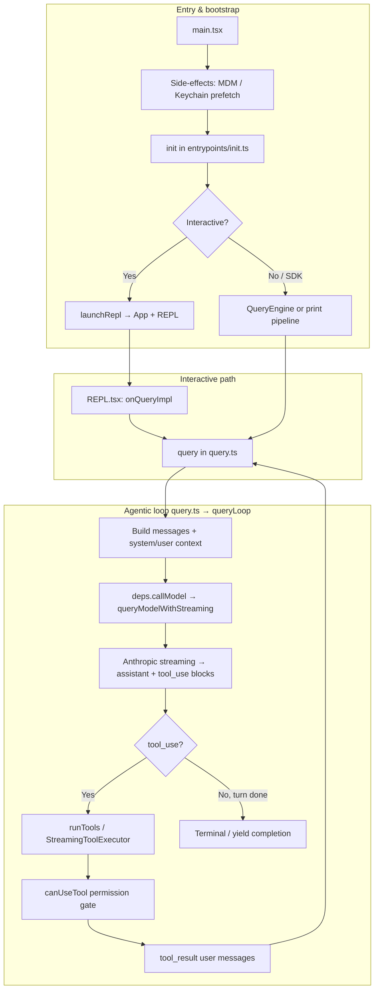

# Claude Code 源码架构与 LLM 工程借鉴分析

**Architecture deep-dive and LLM engineering takeaways for the mirrored Claude Code snapshot.**

> 本仓库为公开快照（见根目录 `README.md` 中的来源说明），本文档仅作**架构研究与教育用途**，不代表 Anthropic 官方文档。

---

## 1. 仓库定位与技术栈（Repository scope & stack）

**中文：** Claude Code 是面向终端的「代理式」开发 CLI：用 **Bun + TypeScript** 实现，终端 UI 为 **React + Ink**，CLI 参数解析为 **Commander.js**，工具入参与配置大量依赖 **Zod**。核心能力包括：与 **Anthropic Messages API** 的流式交互、**MCP / LSP** 扩展、权限门控、子代理（`AgentTool`）、上下文压缩（compact）、会话持久化与遥测等。

**English:** This snapshot is a terminal-first agentic CLI: Bun/TS runtime, React/Ink TUI, Commander for argv, Zod for schemas, streaming Anthropic API, plus MCP/LSP, permissions, sub-agents, compaction, and telemetry—at very large scale (~1.9k files per README).

---

## 2. 端到端总览图（End-to-end overview）

下图从进程入口到一次「用户回合」的模型调用与工具闭环，概括主要边界。



**English:** `main.tsx` bootstraps prefetch and `init`, then either mounts the Ink REPL or runs headless/SDK paths. The REPL’s `onQueryImpl` calls the same `query()` generator as the engine; `queryLoop` alternates **model streaming** and **tool execution** until no follow-up is needed.

---

## 3. 启动与工程调用顺序（Startup call sequence）

### 3.1 `main.tsx` 前置副作用（Pre-import side effects）

在大量模块加载之前，刻意执行：

- `profileCheckpoint('main_tsx_entry')`：启动性能埋点  
- `startMdmRawRead()`：MDM 相关读取（与后续 import 并行）  
- `startKeychainPrefetch()`：OAuth / 旧版 API Key 的钥匙串预取，避免 macOS 上串行阻塞

这些设计直接把「延迟」从关键路径上挪走，属于**可测的启动优化**。

**English:** Top-of-file side effects intentionally parallelize slow OS/config reads with module graph loading—measurable win on cold start.

### 3.2 `entrypoints/init.ts`（Initialization）

`init()`（memoized）负责：启用配置、`applySafeConfigEnvironmentVariables`、CA 证书、优雅退出、异步拉起 GrowthBook / 1P 日志、OAuth 账户信息、策略与远程托管设置加载 Promise、JetBrains 检测、仓库探测等。重模块（如 OpenTelemetry）通过动态 `import()` 延迟。

**English:** `init` centralizes safe env, shutdown hooks, and deferred analytics/telemetry loading.

### 3.3 交互式 UI 挂载（REPL launch）

`replLauncher.tsx` 动态导入 `App` 与 `REPL`，用 `renderAndRun` 挂到 Ink root：

```12:21:src/replLauncher.tsx
export async function launchRepl(root: Root, appProps: AppWrapperProps, replProps: REPLProps, renderAndRun: (root: Root, element: React.ReactNode) => Promise<void>): Promise<void> {
  const {
    App
  } = await import('./components/App.js');
  const {
    REPL
  } = await import('./screens/REPL.js');
  await renderAndRun(root, <App {...appProps}>
      <REPL {...replProps} />
    </App>);
}
```

**English:** Lazy imports keep the initial bundle smaller until the TUI is actually needed.

---

## 4. 用户输入到 query 的调用链（User input → query）

典型交互路径：

1. **输入提交**：`handlePromptSubmit` / `executeUserInput` 协调历史、权限与排队指令。  
2. **语义预处理**：`processUserInput`（`utils/processUserInput/processUserInput.ts`）解析 slash command、附件、钩子（如 `UserPromptSubmit`），决定是否进入 `query`。  
3. **REPL 内调用**：`REPL.tsx` 的 `onQueryImpl` 组装 `userContext`、`systemContext`、`toolUseContext`、effective system prompt，然后 **`for await ... query({...})`**。

代码锚点（REPL → `query`）：

```2790:2801:src/screens/REPL.tsx
    resetTurnHookDuration();
    resetTurnToolDuration();
    resetTurnClassifierDuration();
    for await (const event of query({
      messages: messagesIncludingNewMessages,
      systemPrompt,
      userContext,
      systemContext,
      canUseTool,
      toolUseContext,
      querySource: getQuerySourceForREPL()
    })) {
      onQueryEvent(event);
    }
```

**English:** Slash commands and hooks may short-circuit before `query`; when querying, the REPL streams every event (`stream_event`, `assistant`, tool progress, attachments) through `onQueryEvent`.

---

## 5. `query()` / `queryLoop`：代理回合的核心状态机

`query.ts` 导出异步生成器 `query`，内部 `queryLoop` 维护跨迭代的可变 `State`（messages、`toolUseContext`、自动 compact 追踪、max_output_tokens 恢复计数等）。

### 5.1 对外参数（`QueryParams`）

包含：`messages`、`systemPrompt`、`userContext`、`systemContext`、`canUseTool`、`toolUseContext`、`querySource`、`maxTurns`、可选 `deps`（便于测试注入 `callModel`）等。

### 5.2 模型侧依赖（Default deps）

`query/deps.ts` 将生产路径的 `callModel` 绑定到 `queryModelWithStreaming`（`services/api/claude.ts`），后者再进入 `queryModel`，统一处理流式事件、VCR、重试等。

### 5.3 工具执行层（Tool orchestration）

- **`runTools`**（`services/tools/toolOrchestration.ts`）：按 `partitionToolCalls` 把连续、**并发安全**（`tool.isConcurrencySafe`）的 tool_use 批处理并行执行；写操作或不确定批次则**串行**。  
- **`StreamingToolExecutor`**：在流式响应过程中尽早启动 tool 执行，最后 `getRemainingResults()` 收口，与中断（abort）路径配合，避免「有 tool_use 无 tool_result」。

**English:** Batch parallel read-only tools where schemas declare concurrency safety; serialize mutations; streaming executor pairs with abort to emit synthetic or error `tool_result` blocks consistently.

### 5.4 错误与恢复（Resilience patterns）

`queryLoop` 内含多层工程化细节，例如：

- **模型回退**（fallback）：高负载等场景切换模型并清理 incompatible 的 thinking 签名块。  
- **Prompt too long / 媒体过大**：与 `CONTEXT_COLLAPSE`、`reactiveCompact` 等特性门控协作， withheld 错误消息避免泄漏给 SDK。  
- **用户中断**：abort 时消费 streaming executor 剩余结果或生成缺失的 `tool_result`。

These patterns matter for any long-running agent that must not corrupt the message transcript.

---

## 6. `QueryEngine`：SDK / 无头会话封装

`QueryEngine`（`QueryEngine.ts`）把原先 `ask()` 路径抽成类：**每会话一个实例**，`submitMessage` 开启新回合，跨回合保留 `mutableMessages`、用量累计、文件读缓存等。

- 内部同样调用 `query()`（见文件顶部 `import { query } from './query.js'`）。  
- `canUseTool` 可包装以记录 **SDK 可见的 permission denials**。  
- 支持结构化输出、`snipReplay`（`HISTORY_SNIP`）、thinking 配置、预算等与 REPL 对齐的能力子集。

**English:** `QueryEngine` is the reusable “session object” for headless/SDK consumers; REPL stays richer but shares the same `query()` core.

---

## 7. 子代理与多代理（Agents & coordinator）

- **`runAgent`**（`tools/AgentTool/runAgent.ts`）：以子代理定义、`query()` 为内核，异步任务可把消息写入 `AppState.tasks`，并记录 sidechain transcript。  
- **`runAsyncAgentLifecycle`**：消费 `makeStream`、进度追踪、可选后台摘要（summarization）。  
- **Feature flags**：`COORDINATOR_MODE`、`AGENT_TRIGGERS` 等通过 `bun:bundle` 的 `feature()` 在构建期剔除代码路径。

**English:** Sub-agents are nested `query()` runs with their own tool allowlists and transcript isolation; coordinator/team features are compile-time gated.

---

## 8. 工具注册与扩展面（Tool surface）

`tools.ts` 集中注册数十个工具类，并按 **internal feature / env** 条件加载（如 `SleepTool`、`CronCreateTool`、`WebBrowserTool`、`WorkflowTool`）。与 **`getTools`**、MCP 动态工具合并后进入 `toolUseContext.options.tools`。

**English:** A single registry file plus conditional requires/imports keeps the default install lean while allowing experimental surfaces.

---

## 9. 值得在大模型工程中借鉴的要点（Takeaways for LLM engineering）

| 主题 | 做法摘要 | Why it matters |
|------|----------|----------------|
| **统一 agent 核心** | `query()` 单生成器驱动「模型 → 工具 → 再模型」 | 一处维护 compact、fallback、abort、telemetry；UI 与 SDK 复用 |
| **依赖注入** | `QueryDeps` / `productionDeps()` | 可测、可 mock `callModel`，避免集成测试打真 API |
| **工具并发语义** | `isConcurrencySafe` + 分批 partition | 安全并发只读工具，默认不假设模型顺序即依赖顺序 |
| **流式与工具交织** | `StreamingToolExecutor` | 降低 TTFT、与 abort 一致地闭合 tool_result |
| **权限为一等公民** | `canUseTool` 贯穿 `runTools` / `runToolUse` | 企业场景与 IDE bridge 需要可审计、可重放的门控 |
| **上下文寿命管理** | auto compact、reactive compact、task budget、token 预警 | 长会话产品的边际成本与可靠性关键 |
| **启动与包体** | 顶部并行 prefetch、动态 import、`feature()` 裁剪 | CLI 体验与 binary 体积同时优化 |
| **观测与产品迭代** | OpenTelemetry、GrowthBook、结构化 log events | 迭代 agent 行为需要线上证据，而非仅凭单次演示 |
| **类型与契约** | Zod tool schemas、消息类型联合 | 减少「模型输出结构与执行器假设」漂移 |

**中文小结：** 若你在自建「终端代理」或「IDE 内 copilot」，最值得抄的不是某个 prompt 字符串，而是：**单一 `query` 状态机 + 可注入模型层 + 工具编排与权限钩子 + 上下文压缩与恢复策略 + 构建期特性裁剪** 这一整套工程闭环。

---

## 10. 推荐阅读源码路径（Reading list）

| 路径 | 作用 |
|------|------|
| `src/main.tsx` | CLI 入口、prefetch、migration、子命令分支 |
| `src/entrypoints/init.ts` | 进程级初始化 |
| `src/replLauncher.tsx` | Ink 应用挂载 |
| `src/screens/REPL.tsx` | TUI 主循环与 `query()` 调用 |
| `src/utils/processUserInput/` | 输入解析、slash command、钩子 |
| `src/query.ts` | Agent 回合核心 |
| `src/query/deps.ts` | 生产依赖装配 |
| `src/services/api/claude.ts` | `queryModelWithStreaming` / API 细节 |
| `src/services/tools/toolOrchestration.ts` | 工具分批与并发 |
| `src/QueryEngine.ts` | SDK 会话封装 |
| `src/tools/AgentTool/runAgent.ts` | 子代理 `query` 封装 |
| `src/tools.ts` | 工具注册表 |

---

## 11. 文档版本（Document revision）

- **分析基准：** 仓库内 `src/` 镜像与根 `README.md` 描述一致。  
- **图表：** 文内 Mermaid 可在支持 Mermaid 的 Markdown 查看器（VS Code、GitHub、部分文档站点）中渲染。

---

**English one-liner summary:** Claude Code routes every product surface through a single `query()` state machine over `queryModelWithStreaming`, with injectable deps, permission-gated tool orchestration (parallel-safe batches), streaming-aware execution, and compile-time feature stripping—patterns that transfer directly to other production agent stacks.
